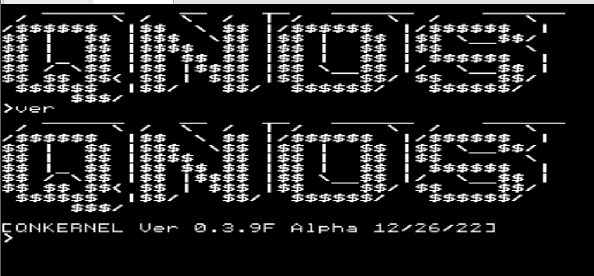
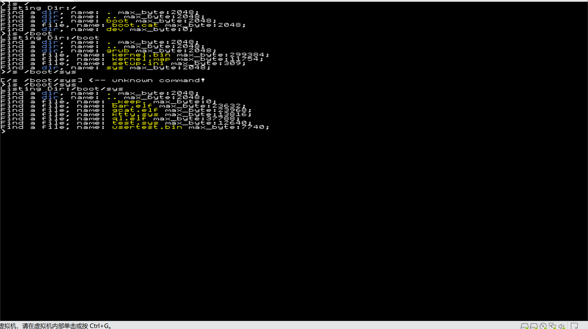
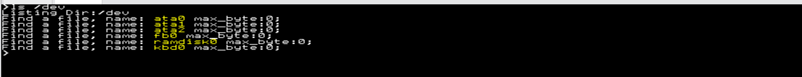
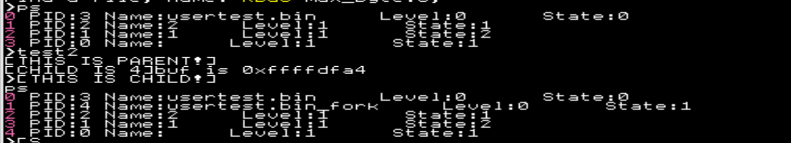
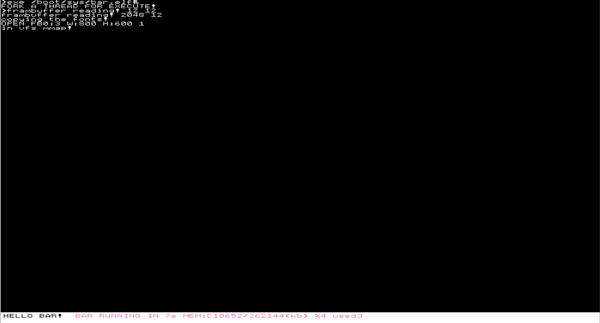
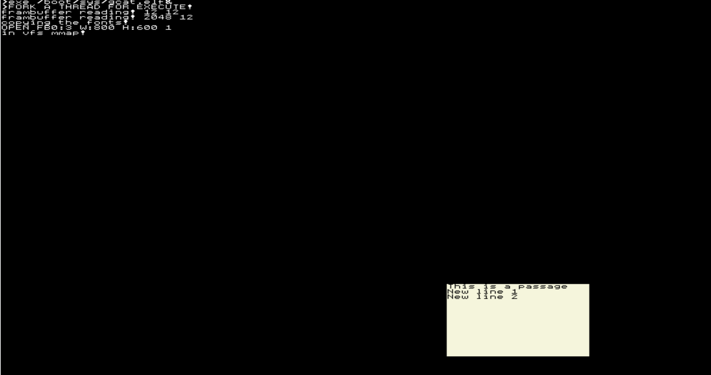
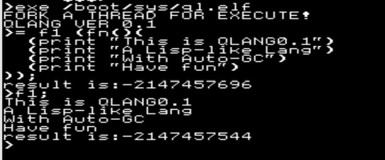

# QNOS Development Doc

## **Introduction**
QNOS is a 32-bit operating system running  
on i386 chips!
## **What was finished?**
1. Boot with grub or grub2
2. Paging & Buddy & slab memory management
3. Kernel Module Dynamic Loader(.so)
4. Multitask & Schedule
5. VFS Framework(iso9660 fatfs ...)
6. Devices enuming (in /dev directory)
7. Basic user-programe library
## **What's the next?**
1. Support more filesystem and devices
2. IPC
3. ...
## **How to Compile it**
### 1. Clone the source code
### 2. Check the compiling environment
    (better in linux) gcc binutils make xorriso 
### 3. Build Toolchains
    make tool
### 4. Build Kernel
    make all
### 5. Build Userprograms
    make sys
### 6. Make ISO Image
    make iso
### 7. Run it on VMWare and have fun!
*NOTE: it cannot run on qemu properlly*
*Because the bad ata drivce*
## **Screen Shots**
* List directories use command 'ls'

* List /dev directory(a virtual directory for devices)

* List all processes with their states

* Test 'fork' function in userland

* 1st userprogram It 'mmap' /dev/fb0 to directly operate the vga buffer to draw a 'bar'

* 2nd read a text file and render it on the screen

* 3rd userprogram: A Lisp-like language interpreter
